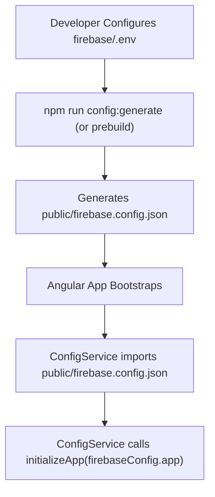

# NgFirebaseImageAnalyzer 🧠🖼️

A high-performance, minimalist Angular 22 single-page application demonstrating **Hybrid Image Analysis** powered by **Firebase AI Logic**. The application is designed to prioritize on-device WebGPU execution (using Gemini Nano) for offline, privacy-first tasks, and falls back dynamically to Cloud-scale Vertex AI models when WebGPU is unavailable or when the client is offline.

The application features a clean, responsive layout styling leveraging modern Tailwind CSS v4, precision logic backgrounds, ambient glowing backdrops, and glassmorphic panels.

---

## 🚀 Key Features

* **Hybrid Inference Engine**: Smart routing between client-side WebGPU (Gemini Nano) and Cloud (Vertex AI) based on browser capabilities and network connectivity.
* **Live Performance Audits**: Visual, high-fidelity latency monitoring of inference cycles.
* **Visual Enhancer Panel**: Adjusts contrast, brightness, and structure of analysed images.
* **App Check Sandbox Support**: Built-in localhost sandbox support to bypass reCAPTCHA Enterprise requirements during local development.

---

## 🛠️ Tech Stack

* **Framework**: Angular v22 (Reactive Signals, Computed properties, functional Dependency Injection `@Service()`)
* **Styling**: Tailwind CSS v4 & PostCSS (Hanken Grotesk, Inter, and Geist font scales)
* **AI Integration**: Firebase JS SDK `v12.15.0` (`firebase/ai` & `firebase/app-check`)
* **Build Pipeline**: Node-based prebuild configuration pipeline, ESLint, Prettier, Husky, Commitlint

---

## 📦 Dependency Installation

To install all dependencies for both the Angular application and the build environment, run:

```bash
npm install
```

---

## 🔑 Environment Configuration & Angular Startup Flow

This repository uses a custom Node.js script to dynamically generate Firebase configuration files.

> [!IMPORTANT]
> The environment variable file `.env` **must** be created inside the `firebase/` subdirectory—**not** the root of the project.

### Step 1: Create the `.env` file

Duplicate the provided `.env.example` inside the `firebase/` folder:

```bash
cp firebase/.env.example firebase/.env
```

### Step 2: Set your credentials

Open `firebase/.env` and supply your actual Firebase keys:

```env
FIREBASE_API_KEY="your-api-key"
FIREBASE_AUTH_DOMAIN="your-auth-domain"
FIREBASE_PROJECT_ID="your-project-id"
FIREBASE_STORAGE_BUCKET="your-storage-bucket"
FIREBASE_MESSAGING_SENDER_ID="your-sender-id"
FIREBASE_APP_ID="your-app-id"
FIREBASE_RECAPTCHA_ENTERPRISE_KEY="your-recaptcha-key"
```

### 🔄 How Configuration Powers Angular Startup

To ensure security and local decoupled execution, the application uses a structured configuration pipeline during app bootstrapping:



During Angular application startup, the `ConfigService` (`src/app/features/ai/services/config.service.ts`) imports the generated JSON:

```typescript
import firebaseConfig from '@/public/firebase.config.json';
```

And immediately uses `firebaseConfig.app` to initialize the Firebase App object:

```typescript
this.#app = initializeApp(firebaseConfig.app);
```

Without this step, the Angular application will fail to boot as it lacks the valid Firebase credentials to instantiate the AI Logic client.

---

## 💻 Run and Build Commands

The project provides npm scripts to run, test, and build the application in various environments:

| Command | Action | URL / Port |
| :--- | :--- | :--- |
| `npm run start` | Launches local Angular development server | `http://localhost:4200` |
| `npm run build` | Runs prebuild config generators and compiles production build | Output: `dist/` |
| `npm run preview` | Runs the compiled production build locally | `http://localhost:5005` |
| `npm run firebase:emulate` | Runs the application using the local Firebase App Hosting Emulator | `http://localhost:5005` |
| `npm run test` | Executes unit tests with the Karma test runner | - |
| `npm run lint` | Runs eslint across codebase | - |

---

## 🛡️ Firebase App Check Setup

Firebase App Check protects your API resources from abuse. In this project, it is secured using **reCAPTCHA Enterprise**.

### Generating a reCAPTCHA Enterprise Key (Production)

1. Navigate to the **reCAPTCHA Enterprise** page in the [Google Cloud Console](https://console.cloud.google.com).
2. Click **Create Key**.
3. Set a display name (e.g., `ng-firebase-image-analyzer-prod`).
4. Select the **Web** platform type.
5. Under **Allowed Domains**, add your production domain names (e.g., `your-app-domain.web.app`).
6. Save the key and copy the generated **Key ID**.
7. Assign this Key ID to `FIREBASE_RECAPTCHA_ENTERPRISE_KEY` inside your environment configuration.

### Local Debugging & App Check Sandbox

To ensure local builds running via `localhost` (such as `npm run start`, `npm run preview`, or `npm run firebase:emulate`) bypass reCAPTCHA validation without failing, the app configures `FIREBASE_APPCHECK_DEBUG_TOKEN = true` under developer/localhost preview environments.

1. Run the application locally in dev or preview mode.
2. Open your browser's developer console (F12).
3. Search for a console log from Firebase App Check containing a temporary debug token:
   `App Check debug token: 12345678-abcd-ef01-2345-6789abcdef01`
4. Copy this debug token.
5. In the [Firebase Console](https://console.firebase.google.com), navigate to **App Check > Apps**.
6. Select your Web app, click the overflow menu (three dots), and select **Manage debug tokens**.
7. Click **Add debug token**, paste your copied token, and save.

---

## ☁️ Firebase App Hosting Deployment

This application is built for seamless deployment using **Firebase App Hosting**.

* **Runtime Configuration**: The deployment configuration is defined in `apphosting.yaml`. It limits active instances (`minInstances: 0`, `maxInstances: 2`) to ensure optimal control over Google Cloud compute costs.
* **Build Pipeline Integration**: Upon pushing changes to your Git repository, Firebase App Hosting automatically executes `npm run build` which invokes the `prebuild` phase (`node firebase/scripts/prebuild.js`) to generate configurations from environment variables securely at compile time.
