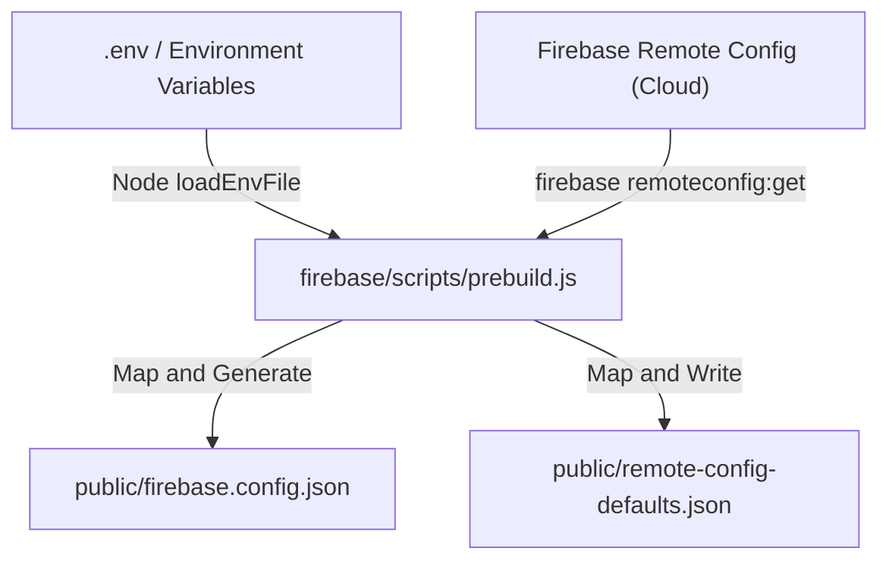

# ADR 01: Core Application Bootstrap, Universal Navigation, and Firebase AI Infrastructure

## Status

**Accepted / Consolidated** (August 2026)

---

## 1. Context and Problem Statement

When bootstrapping a modern full-stack Angular application with server-side rendering (SSR) and cloud integrations, the system must address three critical architectural challenges during startup:

1. **Dynamic Environment Configuration:** Initializing Firebase and Remote Config securely, fetching production configurations on-demand, and shielding credentials (API Keys, Project IDs) from the code repository.
2. **SSR-Safe Browser Redirection:** Programmatic navigation and window/navigator token usage must never crash the Node.js server during pre-rendering, necessitating safe mock injections and centralized navigation paths.
3. **Engine-Agnostic AI Provider Abstraction:** Creating a unified `AiService` interface to support switching between Firebase Cloud Vertex AI (via Firebase AI Logic) and local browser-on-device Gemini Nano engines without modifying feature consumer layers.

---

## 2. Decision and Technical Design

### A. Phase 1: Firebase Environment compilation & Remote Config Fetching

To keep cloud credentials decoupled from Git control and automate builds, a prebuild compiler pipe runs in the root directory:



1. **Environmental Secrets:** Mapped from a local `.env` and loaded securely using Node's native `process.loadEnvFile(envPath)`. Mapped values are written locally as static configuration assets at `public/firebase.config.json` (ignored from Git tracking).
2. **Remote Config Syncing:** Fetched via Firebase CLI and written to `public/remote-config-defaults.json` to act as instant fallback client-side defaults.

### B. Phase 2: App Initialization & Security Hardening (App Check)

At bootstrap, a synchronized Angular `APP_INITIALIZER` reads configuration JSON files and instantiates the core Firebase modules safely:

```typescript
// src/app/app.config.ts
export const appConfig: ApplicationConfig = {
  providers: [
    provideAppInitializer(() => {
      const configService = inject(ConfigService);
      return configService.initialize();
    }),
    provideFirebaseAI(),
  ]
};
```

* **App Check Security:** Leverages `ReCaptchaEnterpriseProvider` to sign cloud queries securely. During development (`isDevMode()`), App Check falls back to a debug token persisted locally to allow developer emulation on local ports.
* **Refresh Intervals:** Remote Config fetching is optimized with a `0-second` interval in local development (instant updates) and a conservative `1-hour` interval in production to eliminate rate-limiting.

### C. Phase 3: The Abstraction Layer (`AiService` Contract)

Consumers do not inject Vertex SDKs directly. Instead, they interact with a unified wrapper designed to support multimodal streams and strict input/output schemas:

```typescript
// src/app/core/ai/services/ai.service.ts
@Service()
export class AiService {
  private readonly firebaseAi = inject(FIREBASE_AI);

  async generateContent(params: GenerateContentParams): Promise<GenerateContentResponse> {
    this.validateInputs(params.contents);
    const model = this.getModel(params.model);
    const response = await model.generateContent(params);
    this.validateResponse(response);
    return response;
  }
}
```

#### Input & Output Hardening Rules

1. **Inputs:** Rejects empty or whitespace-only prompts, enforces binary array checks, and converts raw uploaded files into safe Base64 inline generative `Part` segments (`base64.utils.ts`).
2. **Outputs:** Enforces structural integrity of AI-generated candidate lists. Throws compile-safe runtime errors if the output's first candidate `finishReason` indicates safety blocks or truncation (must be `'STOP'`).

### D. Phase 4: Core Image Analysis Pipeline & Structuring

The primary consumer of `AiService` is the image analysis pipeline, which converts raw binary payloads into structured JSON responses via material schemas:

```typescript
// src/app/features/image-analysis/schemas/image-analysis.schema.ts
export const ImageAnalysisSchema: Schema = {
  type: Type.OBJECT,
  properties: {
    alternativeTexts: { type: Type.ARRAY, items: { type: Type.STRING } },
    tags: {
      type: Type.ARRAY,
      items: {
        type: Type.OBJECT,
        properties: {
          name: { type: Type.STRING },
          sentence: { type: Type.STRING }
        }
      }
    },
    recommendations: { type: Type.ARRAY, items: { type: Type.STRING } },
    colorAdjustment: {
      type: Type.OBJECT,
      properties: {
        brightness: { type: Type.NUMBER },
        saturation: { type: Type.NUMBER },
        contrast: { type: Type.NUMBER },
        warmth: { type: Type.NUMBER }
      }
    }
  }
};
```

* **Image Verifications (`image.utils.ts`):** Pre-validates payloads to ensure binary files are under 20MB and belong to a valid MIME type (`image/*`), preventing unnecessary cloud invocation overhead.

### E. Phase 5: Centralized SSR-Safe Navigation (`NavService`)

To prevent hardcoded navigation routes and secure safety during server pre-rendering, paths are centralized into a single-source-of-truth configuration using TypeScript template literal types:

```typescript
// src/app/core/types/route.types.ts
export const ROUTE_PATHS = {
  HOME: 'home',
  IMAGE_ANALYSIS: 'image-analysis',
} as const;

export type AppRoute = `/${typeof ROUTE_PATHS[keyof typeof ROUTE_PATHS]}`;
```

* **The NavService Provider:**

  ```typescript
  @Service()
  export class NavService {
    private readonly router = inject(Router);
    readonly links: NavLink[] = [
      { label: 'Home', path: '/home' },
      { label: 'Inference', path: '/image-analysis' },
    ];

    to(route: AppRoute): Promise<boolean> {
      return this.router.navigate([route]);
    }
  }
  ```

* **Decoupled Presenters:** Standalone shell structures (such as `<app-header [navLinks]="nav.links" />`) bind to these read-only signals. Direct, non-encapsulated `Router` instances are strictly banned.

---

## 3. Consequences

### Advantages

1. **Clean Code Separation:** Business logic never directly details Firebase secrets, API keys, or raw routing strings.
2. **Total SSR Reliability:** Injectable window context fallbacks ensure that the server-side compiler pre-builds all HTML structures without crashing on window lookups.
3. **Flexible Inference Swapping:** We can hot-swap the underlying AI models (e.g. from cloud Vertex AI Gemini to native client-side Gemini Nano) inside `AiService` seamlessly with zero impact on the consuming feature pages.
4. **Failsafe Executions:** Inputs and outputs are strictly validated, protecting the system against null returns, truncated model content, or malformed image formats.
