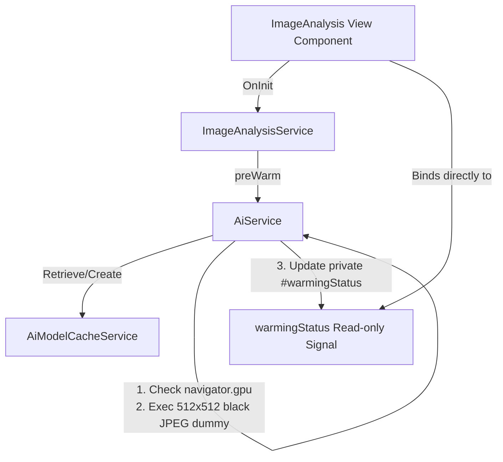

# 15. Optimize On-Device Gemini Nano Performance via Model Caching, WebGPU Pre-Warming, and Shared Service Signals

## Status
**Accepted / Consolidated** (August 2026)

---

## 1. Context and Problem Statement
When running browser-on-device generative AI using Chrome's built-in Gemini Nano model (with the **Firebase AI Logic Web SDK**), three hardware and architectural performance bottlenecks were identified during profiling:

1. **Cold Start Instantiation Overheads:** Every request originally instantiated a fresh `GenerativeModel` instance, forcing the browser's engine to repeatedly pay weight validation and session connection penalties.
2. **WebGPU Shader Compilation Latency:** Even when model weights reside in memory, WebGPU must compile its mathematical shader pipelines (WGSL) during the very first forward pass, freezing execution for up to 9 seconds on first click.
3. **Tensor Shape Discrepancy compilation:** WebGPU compiles shaders optimized for the *exact pixel dimensions* of the input tensor. If the pre-warm dummy image and the actual analysis file have different dimensions, WebGPU discards its compiled shaders and runs a slow compilation loop again.
4. **Boilerplate Callbacks:** Tracking pre-warming status (e.g., `Compiling 512x512 shaders...`) to disable the file uploader originally utilized deep callback function trees (`onProgress: (step: string) => void`), introducing heavy method signature coupling and component-side clutter.

---

## 2. Decision and Technical Design

To achieve instant first-time execution, we decoupled **Model Caching**, **Shader Compiling**, and **Progress Tracking** into a unified, highly reactive architecture.



### A. Phase 1: The Model Caching Service (`AiModelCacheService`)
We extracted weight lifecycle concerns into a dedicated cache service. It derives deterministic cache keys strictly from static parameters (model name, thinking level, system instruction, schema) to keep transient payload inputs (`contents`) from corrupting the cache.

```typescript
// src/app/features/ai/services/ai-model-cache.service.ts
@Service()
export class AiModelCacheService {
  #ai = inject(FIREBASE_AI);
  #configService = inject(ConfigService);
  #modelCache = new Map<string, GenerativeModel>();

  getOrCreateModel(config: ModelConfigParams): GenerativeModel {
    const cacheKey = this.getCacheKey(config);
    if (this.#modelCache.has(cacheKey)) {
      return this.#modelCache.get(cacheKey)!;
    }

    const modelParams = this.constructModelParams(config);
    const model = getGenerativeModel(this.#ai, modelParams);
    this.#modelCache.set(cacheKey, model);
    return model;
  }
}
```

### B. Phase 2: WebGPU Shader Pre-Warming & Static Tensor Shaping
To completely eliminate WebGPU's cold shader compilation delays:
1. **In-Memory Resizing:** Every user-provided image is scaled in-memory via an HTML5 canvas to exactly `512x512` pixels before being transmitted to the AI, ensuring perfect tensor shape consistency.
2. **Mock Forward Pass:** During pre-warming, `AiService` generates an identical `512x512` black JPEG, executing a silent mock inference. This compiles WebGPU's shaders in the background. On the user's first click, WebGPU uses the existing hot shader cache, executing instantly.
3. **Hardware Guarding:** Pre-warming checks `navigator.gpu` before generating the mock query. On devices lacking WebGPU capabilities, mock execution is gracefully bypassed to protect CPU resources.

### C. Phase 3: Declarative Progress Tracking via Shared Service Signals
To eliminate callback signatures, we adopted a **Shared Service Signals** pattern. State is managed centrally, and consuming templates bind directly to read-only reactive properties:

```typescript
// src/app/features/ai/services/ai.service.ts
@Service()
export class AiService {
  #cacheService = inject(AiModelCacheService);
  
  // Writable private signal, exposed publically as read-only
  #warmingStatus = signal<string | null>(null);
  public readonly warmingStatus = this.#warmingStatus.asReadonly();

  async preWarmModel(params: GenerateContentParams): Promise<void> {
    const model = this.#cacheService.getOrCreateModel({
      schema: params.schema,
      systemInstruction: params.systemInstruction,
    });

    this.#warmingStatus.set('Initializing model weights...');
    await this.downloadDeviceModel(model);

    if (this.isWebGpuSupported()) {
      this.#warmingStatus.set('Compiling WebGPU 512x512 shaders...');
      await this.runSilentDummyQuery(model);
    }
    
    this.#warmingStatus.set(null); // Reset when complete
  }
}
```

---

## 3. Implementation Blueprint

### 1. Presenter Integration (`image-analysis.ts`)
The `ImageAnalysisService` simply mirrors the core status signal, which is directly consumed by the parent page and passed as a reactive property to the file uploader:

```typescript
// src/app/features/image-analysis/services/image-analysis.ts
@Service()
export class ImageAnalysisService {
  #aiService = inject(AiService);
  public readonly warmingMessage = this.#aiService.warmingStatus;

  async preWarm(): Promise<void> {
    await this.#aiService.preWarmModel({
      systemInstruction: SYSTEM_INSTRUCTION,
      contents: [],
      schema: ImageAnalysisSchema,
    });
  }
}
```

### 2. Lifecycles in Component
```typescript
@Component({
  selector: 'app-image-analysis',
  template: `
    <app-image-uploader 
      [disabled]="!!imageAnalysisService.warmingMessage()" 
      [statusMessage]="imageAnalysisService.warmingMessage()"
    />
  `
})
export default class ImageAnalysis implements OnInit {
  protected readonly imageAnalysisService = inject(ImageAnalysisService);

  ngOnInit() {
    this.imageAnalysisService.preWarm().catch((err) => {
      console.warn('Pre-warming bypassed. Swapping to cloud dynamically.', err);
    });
  }
}
```

---

## 4. Consequences and Advantages

* **Sub-Second Click Latency:** Reduces subsequent on-device prompt execution delays to near zero, yielding local response times that feel exceptionally fast.
* **100% Declarative and Callback-Free:** Components automatically synchronize with background loading states via Signals, eliminating complex promise-handling boilerplate.
* **Type Safety & Platform Decoupling:** Replaces direct Chrome API calls with standard WebGPU feature checks, maintaining absolute environment safety during server-side pre-rendering.
* **Intelligent Auto-Fallbacks:** If a device fails to satisfy WebGPU or Local Gemini dependencies, pre-warming fails silently, and subsequent analysis falls back gracefully to Vertex AI cloud processing.
