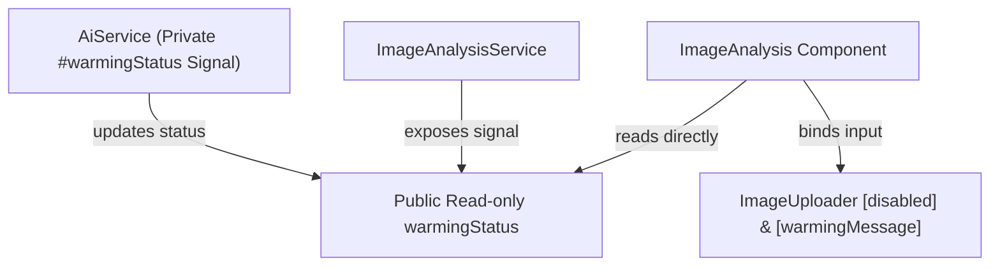

# ADR 17: Shared Service Signals for Pre-Warm Progress Tracking

## Context and Problem Statement

To optimize the WebGPU shader compilation performance of Google Gemini Nano on-device AI, we implemented a background `preWarm` process. During this pre-warming phase, we disable the `ImageUploader` component and display a dynamic progress description (e.g., `Compiling 512x512 shaders...`).

Initially, we implemented this progress reporting using a **standard JavaScript callback function** (`onProgress: (step: string) => void`) passed from the component through the services down to the AI model compilation loop. While simple, passing callback handlers across multiple service boundaries increases signature coupling, adds boilerplate to parent components, and is less idiomatic in modern Angular 19+ apps that favor fully declarative **Signals**.

We need an elegant, robust, and highly reactive pattern to track pre-warming progress without relying on callback pipelines.

---

## Decision Choices

### Option A: Shared Service Signals (Selected)

Define a writable private Signal (`#warmingStatus = signal<string | null>(null)`) directly inside `AiService`. Expose it as a public, read-only Signal (`public readonly warmingStatus = this.#warmingStatus.asReadonly()`). The component directly injects the service and reads this signal in its template or computed bindings.

* **Pros:**
  * **Ultra-Idiomatic**: Leverages Angular 19's native reactive Signals.
  * **Zero Signature Coupling**: Removes callback parameters from service methods.
  * **Consistently Synchronized**: Multiple independent components can read the exact same pre-warm status concurrently.
  * **Low Boilerplate**: No need to subscribe/unsubscribe or manage manual local signals in the calling components.
* **Cons:**
  * Slightly increases the stateful nature of `AiService`, though pre-warming is inherently a global app-lifecycle state.

### Option B: RxJS Progress Stream

Expose an `Observable<string>` progress stream from `preWarm()`, allowing components to use Angular's `toSignal()` helper to bind to it.

* **Pros:**
  * Provides powerful RxJS operator support (e.g., filtering, throttling, retry logic).
* **Cons:**
  * Unnecessary overhead and boilerplate for a straightforward sequential string-status update.

### Option C: Centralized UI State Store

Create a dedicated component-level or global UI State Store (using a custom Store pattern or RxState) managing the entire lifecycle of the uploader.

* **Pros:**
  * Perfect for large, highly complex state configurations.
* **Cons:**
  * Over-engineered for our current requirements, though Option A naturally scales into Option C if the app grows.

---

## Decision Outcome

We choose **Option A: Shared Service Signals**.

This decision provides a 100% Signal-native, highly reactive, and decoupled architecture. The service remains the single source of truth for on-device AI lifecycle state, and components automatically reflect updates with zero manual callback coordination.

### Architectural Blueprint

---

## Implementation Action Plan

### 1. Update `AiService` (`ai.service.ts`)

* Import `signal`.
* Declare `#warmingStatus = signal<string | null>(null);` and `public readonly warmingStatus = this.#warmingStatus.asReadonly();`.
* Update `preWarmModel` to set `#warmingStatus` dynamically during steps and reset to `null` inside a `finally` block to guarantee clean state teardown.

### 2. Update `ImageAnalysisService` (`image-analysis.ts`)

* Expose `public readonly warmingMessage = this.#aiService.warmingStatus;`.
* Remove `onProgress` parameter from `preWarm()`.

### 3. Update Component (`image-analysis.ts`)

* Remove local `isWarming` and `warmingMessage` component signals.
* Bind directly to `imageAnalysisService.warmingMessage`.
