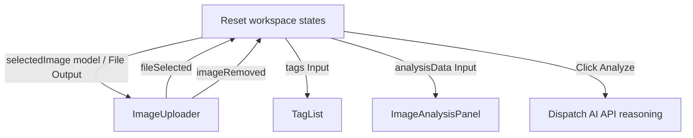

# Design System: Image Analysis Demo (Firebase AI Logic)

This document outlines the detailed design system, layout, and component architecture for the **Image Analysis Demo** feature, as extracted from the Stitch project design tokens and screen specifications for `projects/13661591537633294133/screens/916bd571d505495da9e9cb3ce284eaee`.

---

## 1. Atmosphere & Brand Identity

The brand identity centers on **Firebase AI Logic**, projecting a sense of security, intelligence, and high-performance computing.

* **Aesthetic Tone**: Corporate, modern, and leaning heavily toward minimalism.
* **Visual Elements**:
  * **Glass Panels**: Subtle semi-transparent surfaces with high-blur background filters (`backdrop-filter: blur(12px)`) to establish visual depth.
  * **Status & Alert Indicators**: Highly descriptive interactive states, such as floating tooltips and dynamic animations (e.g., loading states and transition-all animations).

---

## 2. Page & Layout Structure

The layout is built with standard 12-column grid containers locked to a max-width of `1280px` (`max-w-container-max`). Spacing scales use a base unit of `4px` (`sm=8px`, `md=16px`, `lg=24px`, `xl=32px`, `xxl=64px`).

### 2.1 Fixed Header Navigation

* **Structure**: Flex container with 16px vertical padding (`h-16`), horizontal gutters, and backdrop blur filter for scrolling overlay effects.
* **Brand Block**: "Firebase AI Logic" bold logotype.
* **Menu Options**: Links for Platform, Inference, Documentation, and Pricing.
* **CTAs**: Transparent secondary "Log In" button and solid primary "Get Started" button.

### 2.2 Hero Header & Upload Area

* **Inference Showcase Header**: Centered title "Image Analysis" in `headline-lg` hierarchy, followed by descriptive text in `on-surface-variant`.
* **Dynamic Preview Card**:
  * Light background canvas `surface-container-low` with thin border and subtle drop shadows.
  * Preview image showing the currently selected/uploaded image.
  * Contextual floating actions such as a "Delete/Remove" button with standard Material symbol icons, appearing on hover.
* **Interactive Analyze Button**: Appears once an image is uploaded, prompting the user to dispatch inference. Displays a premium micro-animated loading indicator while processing is active.

### 2.3 Semantic Tag Cloud

* Interactive tag widgets displaying detected image categories (e.g. `Orange Tabby`, `Domestic Cat`).
* **Interactive Tooltips**: Hovering over tags triggers smooth CSS transition-opacity reveals of absolute-positioned tooltips containing structured analytical justification.

---

## 3. Advanced Analysis Panel (Tabbed Results)

The results section employs a 4-tab control system allowing developers and researchers to deep-dive into multi-modal metadata:

### 3.1 Thought Summary

* Custom card utilizing glassmorphic aesthetics.
* Focuses on presenting AI reasoning, model confidence scores, and structured insights (e.g. identifying breed, environment context, lighting conditions).

### 3.2 Recommendations List

* Structured list of composition, visual, and lighting suggestions (e.g. cropping guides, color balance shifts).
* Features high-contrast labels and secondary supporting descriptions.

### 3.3 Token Usage Analytics

* **Stacked Progress Bar**: Custom horizontal compound bar displaying relative ratio of:
  * **Input Tokens** (Primary Color)
  * **Output Tokens** (Secondary Color)
  * **Cached Tokens** (Tertiary Color)
  * **Thought/Reasoning Tokens** (Primary Container Accent)
* Detailed breakdown charts illustrating prompt modality details (text vs. image), output details, and cache status with precise numeric counts.

### 3.4 Image Improvement (AI Enhanced Preview)

* **Metadata Sidebar**: Column displaying crop coordinates/aspect ratios and precise filtering metadata (brightness, saturation, contrast adjustments).
* **Enhanced Canvas**: Interactive high-fidelity optimized preview showing the filtered/cropped output with download capability.

---

## 4. Design Tokens & Styling Guides

### 4.1 Typography Scales

* **Headline / Display**: `Hanken Grotesk` (contemporary geometry, tight tracking).
* **Body / Paragraph**: `Inter` (neutral, professional readability).
* **Labels / Code**: `Geist` (monospaced technical aura).

### 4.2 Interactive Components Rules

* **Primary Button**: Indigo-600 background with soft gradients, white labels, and subtle scaling transforms on interactions.
* **Tabs**: Bottom-bordered indicators dynamically active on click.
* **Glass Cards**: Semi-transparent backgrounds (`rgba(255, 255, 255, 0.7)`) with a subtle `1px` border of `rgba(211, 228, 254, 0.5)`.

---

## 5. Main Component Integration: ImageAnalysis

This section specifies how the main `ImageAnalysis` component orchestrates the `ImageUploader`, `TagList`, and `ImageAnalysisPanel` into a cohesive, responsive workspace, featuring an explicit "Analyze Image" action button.

### 5.1 Orchestration Architecture



### 5.2 TypeScript Specification (`image-analysis.ts`)

The orchestrator manages reactive signals for storing the current uploaded file reference, image URL, classifications, and token budgets, calling the injected `ImageAnalysis` service to fetch actual neural metadata:

```typescript
import { Component, inject, signal, ChangeDetectionStrategy } from '@angular/core';
import { CommonModule } from '@angular/common';
import { ImageUploader } from '../../shared/image-uploader/image-uploader';
import { TagList, ImageTag } from './tag-list/tag-list';
import { ImageAnalysisPanel } from './image-analysis-panel/image-analysis-panel';
import { ImageAnalysis as ImageAnalysisService } from '@/features/image-analysis/services/image-analysis';
import { ImageAnalysisWithMetadata } from '@/features/image-analysis/types/image-analysis-metadata.type';

@Component({
  selector: 'app-image-analysis',
  standalone: true,
  imports: [CommonModule, ImageUploader, TagList, ImageAnalysisPanel],
  templateUrl: './image-analysis.html',
  styleUrl: './image-analysis.css',
  changeDetection: ChangeDetectionStrategy.OnPush,
})
export class ImageAnalysis {
  // Inject the actual neural analysis service as demonstrated in src/app/app.ts
  imageAnalysisService = inject(ImageAnalysisService);

  // Local reactive states using service-defined types directly
  imageUrl = signal<string | null>(null);
  selectedFile = signal<File | null>(null);
  tags = signal<ImageTag[]>([]);
  analysisData = signal<ImageAnalysisWithMetadata | null>(null);
  isLoading = signal<boolean>(false);

  onFileSelected(file: File) {
    this.selectedFile.set(file);
    this.tags.set([]);
    this.analysisData.set(null);
  }

  /**
   * Triggers the image analysis by executing the analyzeImage method of the
   * injected ImageAnalysis service and directly storing the raw metadata response.
   */
  async triggerAnalysis() {
    const file = this.selectedFile();
    if (!file) return;

    try {
      this.isLoading.set(true);
      
      // Dispatch analysis requests directly to AI Service
      const response = await this.imageAnalysisService.analyzeImage(file);
      
      // Map API Response tags list to the Tag Cloud widget models
      this.tags.set(response.analysis.tags.map(t => ({
        label: t.name,
        tooltip: t.reason
      })));

      // Set the full ImageAnalysisWithMetadata model directly onto the reactive state signal
      this.analysisData.set(response);
    } catch (error) {
      console.error('Failed to analyze image with API', error);
    } finally {
      this.isLoading.set(false);
    }
  }

  onImageRemoved() {
    this.selectedFile.set(null);
    this.tags.set([]);
    this.analysisData.set(null);
  }
}
```

### 5.3 HTML Template Layout (`image-analysis.html`)

```html
<div class="workspace-container">
  <!-- Upload State Area -->
  <app-image-uploader
    [(imageUrl)]="imageUrl"
    (fileSelected)="onFileSelected($event)"
    (imageRemoved)="onImageRemoved()"
  ></app-image-uploader>

  <!-- Explicit Analyze Action Button -->
  @if (imageUrl() && !analysisData() && !isLoading()) {
    <div class="action-container">
      <button (click)="triggerAnalysis()" class="primary-action-btn">
        <span class="material-symbols-outlined">psychology</span>
        Analyze Image
      </button>
    </div>
  }

  @if (isLoading()) {
    <div class="loading-container">
      <div class="loading-spinner"></div>
      <p class="loading-text">Processing multimodal neural tokens...</p>
    </div>
  } @else {
    @if (tags().length > 0) {
      <!-- Semantic Tag Cloud -->
      <div class="tag-cloud-section">
        <h4 class="section-subtitle">Detected Classifications</h4>
        <app-tag-list [tags]="tags()"></app-tag-list>
      </div>
    }

    @if (analysisData()) {
      <!-- Advanced Analysis Results Panel -->
      <app-image-analysis-panel [data]="analysisData()"></app-image-analysis-panel>
    }
  }
</div>
```

